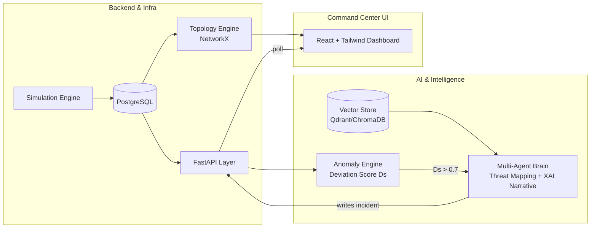

# 🛡 KritiShield AI

**AI-Driven Cyber Resilience for Critical National Infrastructure**

Built for the **ET Hackathon** (July 2026) — a working prototype that detects behavioural cyber anomalies in real time, explains them in plain English using a multi-agent AI system, and visualises everything on a live security command center.

---

## 📌 The Problem

Critical infrastructure — hospitals, exam boards, government systems — is a growing target for cyberattacks. Incidents like the **AIIMS Delhi ransomware attack** and the **CBSE data breaches** show a common pattern: most breaches are discovered *weeks or months* after the fact, because traditional tools rely on known malware signatures instead of behaviour.

- Over **70%** of government IT infrastructure runs on end-of-life systems.
- Advanced Persistent Threats (APTs) move slowly and quietly to evade signature-based detection.
- What's needed: a **behavioural intelligence layer** that flags anomalies, maps them to known attack patterns, and responds automatically — cutting detection time from weeks to hours.

## 💡 What We Built

KritiShield AI simulates a live infrastructure environment, scores behavioural deviations in real time, triggers a multi-agent AI pipeline to identify and explain threats, and renders it all on a dark-themed security dashboard — no live production systems required.

## ✨ Features

### Backend & Infrastructure Simulation
- PostgreSQL-backed database tracking assets, live activity logs, incidents, and known vulnerabilities
- Network activity simulation engine — continuous normal traffic + on-demand attack injection (credential misuse, lateral movement)
- Topology engine (NetworkX) computing asset relationships as a node/edge graph
- FastAPI service layer exposing metrics, alerts, and simulation triggers, plus automated containment endpoints (isolate asset, revoke credential)

### AI & Intelligence Layer
- Vector store (RAG) seeded with public vulnerability data for semantic security-context retrieval
- Behavioural anomaly engine producing a live deviation score **Ds** (0.0 – 1.0) from log/traffic patterns
- Multi-agent workflow, auto-triggered when **Ds > 0.7**:
  - **Agent 1 — Threat Mapping**: maps the event sequence to known attack tactics, predicts the adversary's next move
  - **Agent 2 — Explainable AI Narrative**: generates a plain-English explanation of the triggered action
- Structured output enforcement so agent responses map cleanly into the incident database

### Frontend — Security Command Center
- Dark-themed dashboard built with React + Tailwind CSS
- Interactive live network topology map
- Lateral-movement indicators — connections flash red on active traversal threats
- Live threat ticker, network health metrics, prioritised vulnerability checklist
- Simulation control panel for judges to trigger scenarios in real time
- Real-time polling to keep graphs, metrics, and logs in sync

## 🏗 Architecture



**Flow:** simulation logs → PostgreSQL → anomaly engine scores deviation → if `Ds > 0.7`, multi-agent brain identifies the attack and writes an explained incident back → dashboard polls and updates live.

## 🛠 Tech Stack

| Layer | Technology |
|---|---|
| Backend framework | Python 3 + FastAPI |
| Database | PostgreSQL |
| Graph computation | NetworkX |
| Agentic framework | CrewAI |
| Vector store (RAG) | Qdrant |
| LLM inference | Llama 3 via fast-hosting API (e.g. Groq) |
| Frontend | React (ES6+), HTML5, CSS3 |
| Styling | Tailwind CSS |
| Graph visualisation | Vis.js Network / Cytoscape.js |

## 📂 Project Structure

```
kritishield-ai/
├── backend/          # FastAPI app, DB models, simulation engine, topology logic
├── frontend/          # React + Tailwind dashboard
├── docs/              # Architecture diagram, presentation deck, demo video
└── README.md
```
*(Adjust to match your actual repo layout.)*

## 🚀 Getting Started

### Prerequisites
- Python 3.10+
- Node.js 18+
- PostgreSQL (local or containerized)
- API key for your chosen LLM inference provider

### Backend
```bash
cd backend
# configure DB connection and secrets in .env
uvicorn main:app --reload
```

### Frontend
```bash
cd frontend
npm install
npm run dev
```

## 🎯 Evaluation Focus

- Anomaly detection rate & false positive rate
- APT attribution accuracy (MITRE ATT&CK technique level)
- Incident response automation coverage
- MTTD / MTTR improvement vs. baseline SOC
- Full auditability of every automated action

## 📦 Deliverables

- ✅ Working prototype
- ✅ Architecture diagram
- ✅ Presentation deck
- ✅ Demo video

## 👥 Team

| Role | Focus |
|---|---|
| Infrastructure & Systems Engineer | Backend, database, simulation engine, topology graph |
| AI & Intelligence Engineer | Anomaly detection, multi-agent orchestration, RAG |
| Frontend & UX Engineer | Security command center dashboard |

---

*Built for the ET Hackathon — AI-Driven Cyber Resilience for Critical National Infrastructure.*
